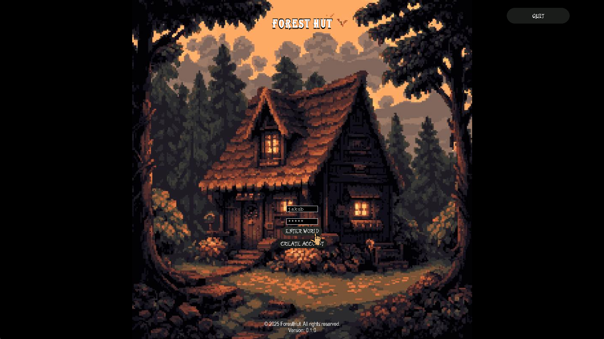
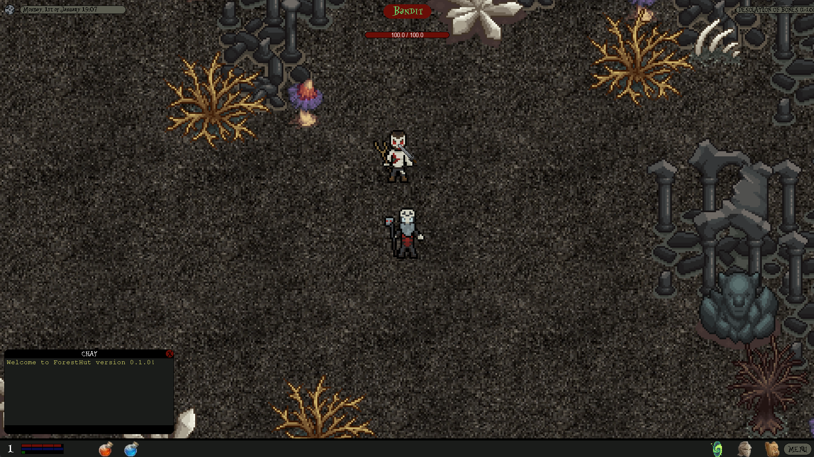
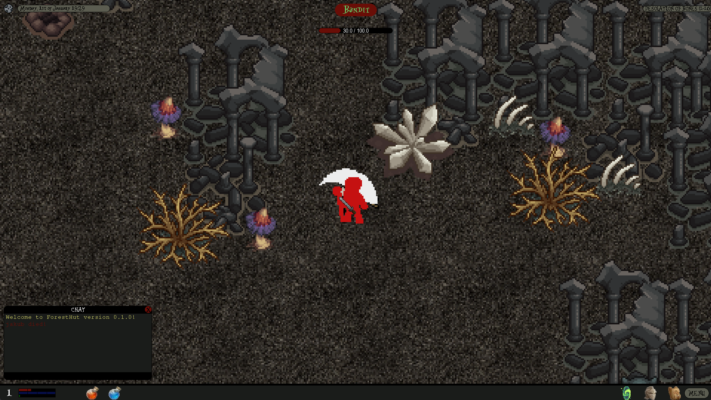
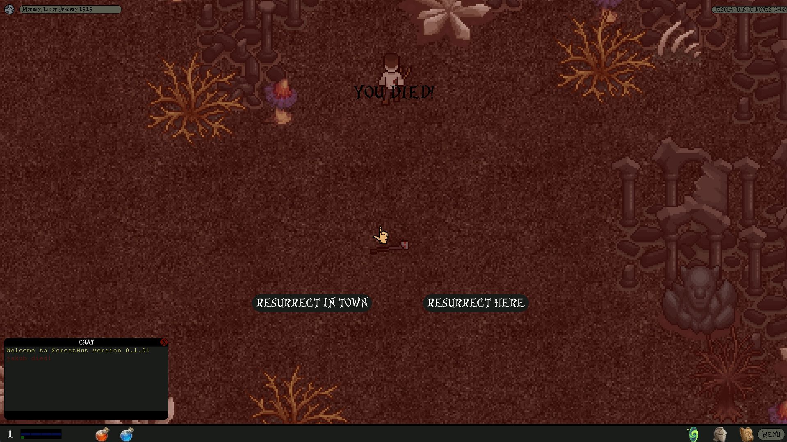
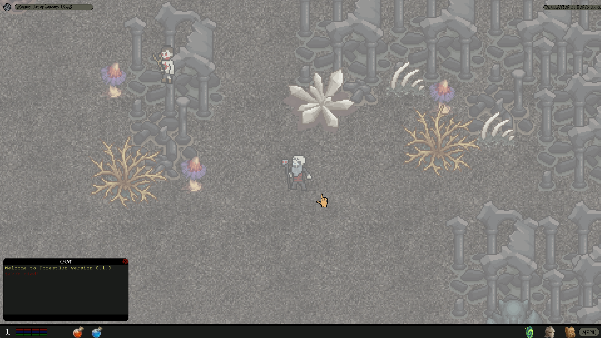
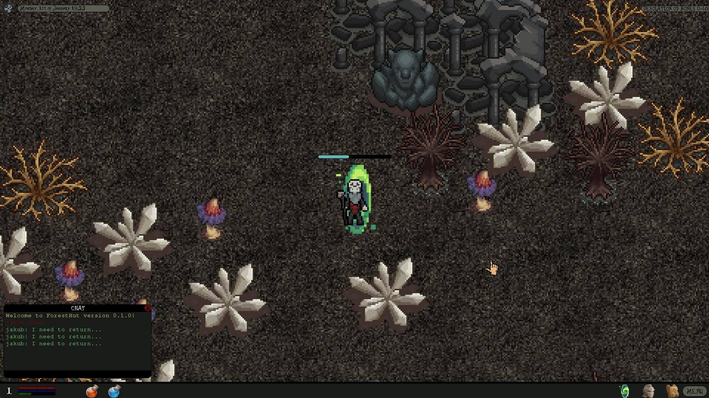
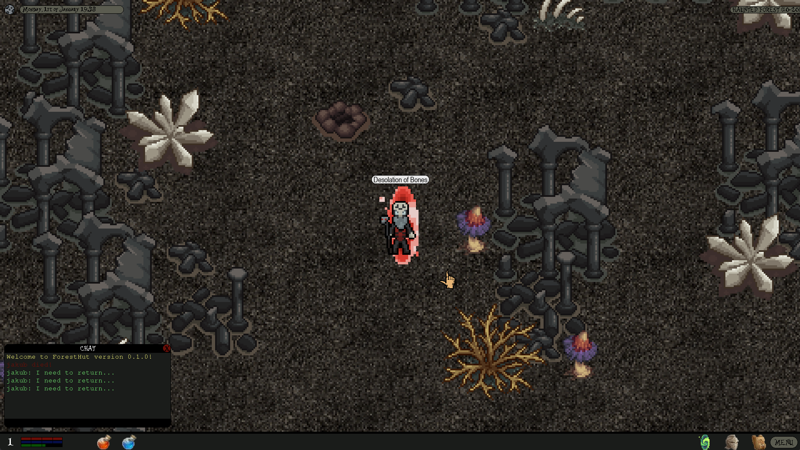
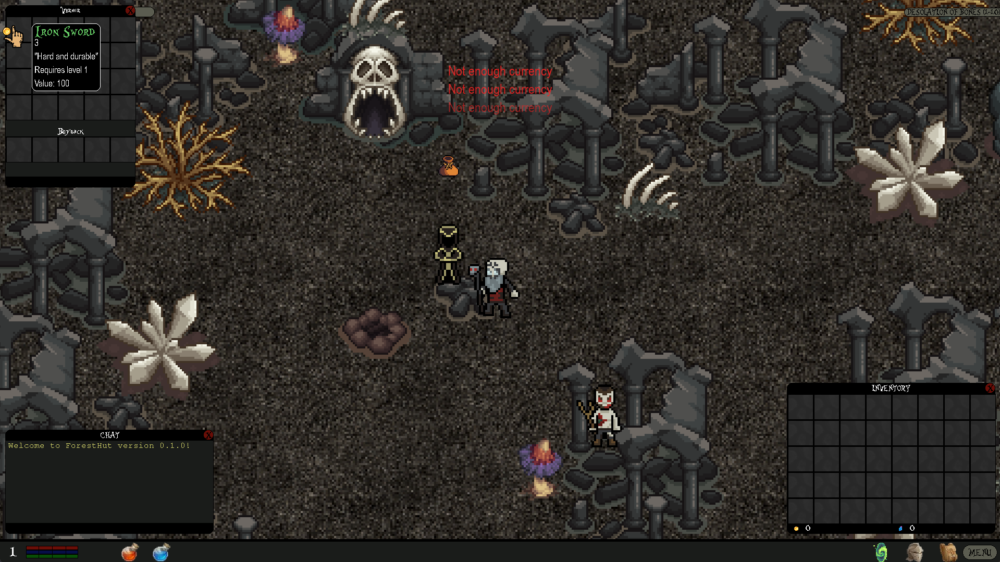

# ForestHut

## About

ForestHut is a hobby project aimed at creating a hack'n'slash game using a custom game engine built with the Pygame
library in Python.
Started on 21st October 2024, and work is still in progress.

## Contents
- [Screenshots](#screenshots)
- [Requirements](#requirements)
- [How to run](#how-to-run)
- [Version](#version)
- [Author](#author)

## Screenshots










## Requirements

Required software and dependencies:

- Python 3.12+
- Libraries from `requirements.txt`

## How to run

1. Clone the repository:
   ```bash
   git clone https://github.com/JakubJagodzinski/forest-hut.git
   ```
2. Navigate to the project directory:
   ```bash
   cd ForestHut
   ``` 
3. Install the necessary dependencies:
   ```bash
   pip install -r requirements.txt
   ```
4. Run the game:
   ```bash
   python main.py
   ```

## Version
0.1.0

## Author
Jakub Jagodziński
